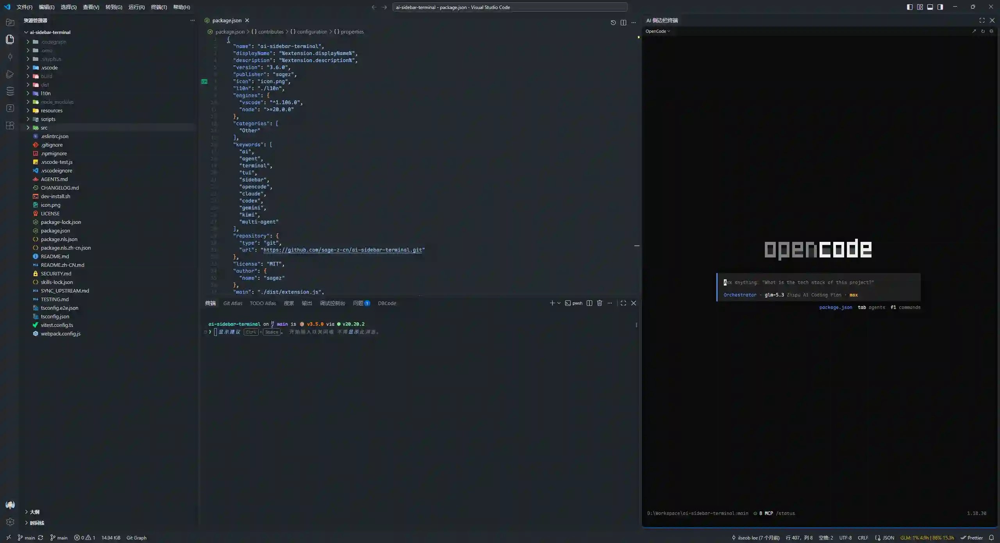

# AI Sidebar Terminal

[](https://marketplace.visualstudio.com/items?itemName=sagez.ai-sidebar-terminal)

[中文文档](https://github.com/sage-z-cn/ai-sidebar-terminal/blob/main/README.zh-cn.md)

Embed multiple AI coding agents (OpenCode, Claude Code, Codex, Gemini CLI, Kimi Code, Qwen Code, Mimo Code, or any custom AI tool) in the VS Code sidebar with full terminal management.



## Features

- **Auto-launch AI Tools**: Automatically start your chosen AI coding agent when the sidebar is activated
- **Full TUI Support**: Complete terminal emulation with xterm.js and WebGL rendering
- **Multi-AI Tool Support**: Built-in support for OpenCode, Claude Code, Codex, Gemini CLI, Kimi Code, Qwen Code, Mimo Code with custom tool configuration
- **Single-Terminal**: Focused single-terminal experience with session/instance switching
- **Pill Dropdown Toolbar**: Unified pill-style dropdowns for quick AI tool switching
- **HTTP API Integration**: Bidirectional communication with OpenCode CLI via HTTP API (OpenCode v1 and v2 supported)
- **Auto-Context Sharing**: Automatically shares editor context when terminal opens
- **File References with Line Numbers**: Send file references with `@filename#L10-L20` syntax
- **Code Actions**: Diagnostic-triggered code actions for errors and warnings
- **Keyboard Shortcuts**: `Alt+A` to send file reference, `Cmd+Alt+A` to send all open files
- **Image Paste Support**: Paste images from clipboard directly into the terminal
- **Drag & Drop Support**: Hold Shift and drag files/folders to send as references
- **Context Menu Integration**: Right-click files in Explorer, text in Editor, or editor tabs to send to AI terminal
- **Secondary Sidebar**: Dock the terminal in the secondary sidebar for split-screen workflows
- **Configurable**: Customize command, font, terminal settings, HTTP API behavior, and AI tool preferences

## Architecture

This extension provides a **sidebar-only** terminal experience. AI tools run embedded in the VS Code sidebar Activity Bar, not in the native VS Code terminal panel.

### Communication Architecture

The extension uses a hybrid communication approach:

1. **HTTP API**: Primary communication channel with OpenCode CLI
   - OpenCode v1 and v2 supported (detected automatically via `opencode --version`)
   - v1: ephemeral port range 16384-65535, launched with `--port=N`
   - v2: connects to the OpenCode background service (discovered from its service state file) with Basic authentication

2. **WebView Messaging**: Terminal I/O between extension host and sidebar WebView
   - xterm.js for terminal rendering
   - Bidirectional message passing for input/output

## Usage

1. Click the AI Sidebar Terminal icon in the Activity Bar (sidebar)
2. The terminal automatically starts when the view is activated
3. Interact with your AI tool directly in the sidebar

## Commands

### Basic Commands

- **AI Sidebar Terminal: Start OpenCode** - Manually start the AI tool
- **AI Sidebar Terminal: Paste** - Paste text into the terminal
- **AI Sidebar Terminal: Focus Terminal** - Focus the sidebar terminal

### File Reference Commands

- **Send File Reference (@file)** (`Alt+A`) - Send current file with line numbers
  - No selection: `@filename`
  - Single line: `@filename#L10`
  - Multiple lines: `@filename#L10-L20`
- **Send All Open File References** (`Cmd+Alt+A` / `Ctrl+Alt+A`) - Send all open file references
- **Send to AI Terminal** - Send selected text or file from context menu to the active AI agent
- **Send to Active Terminal** - Send selected text to the active terminal

### Keyboard Shortcuts

| Shortcut                   | Command             | Context                        |
| -------------------------- | ------------------- | ------------------------------ |
| `Alt+A`                    | Send File Reference | Editor or Terminal             |
| `Cmd+Alt+A` / `Ctrl+Alt+A` | Send All Open Files | Editor or Terminal             |
| `Cmd+V` / `Ctrl+V`         | Paste               | Terminal focused               |
| `Ctrl+P`                   | Pass through        | Terminal focused (passthrough) |

### Context Menu Options

- **Explorer**: Right-click any file or folder → "Send to AI Terminal"
- **Editor**: Right-click anywhere → "Send to AI Terminal" (still sends `@file` with selection line numbers via the `sendAtMention` command, identical to `Alt+A`)
- **Editor Tab**: Right-click any editor tab → "Send to AI Terminal" (sends the active editor's `@file` reference)

> All three menus appear at the top of their respective context menus with the same label. The Editor menu and `Alt+A` shortcut preserve selection line numbers (`@file#L10-L20`); the Explorer and Tab menus send plain `@file` references.

### Drag & Drop

- Hold **Shift** and drag files/folders to the terminal to send as `@file` references

## HTTP API Integration

The extension communicates with OpenCode CLI via an HTTP API for reliable bidirectional communication:

### Features

- **Version Detection**: Detects OpenCode v1/v2 automatically via `opencode --version` (major version >= 2 is treated as v2)
- **Auto-Discovery**: Discovers the HTTP server for v1 (ephemeral ports) and the background service for v2 (service state file, or `opencode service status` as fallback)
- **Health Checks**: `GET /global/health` (v1) or `GET /api/info` (v2) validates availability before sending commands
- **Retry Logic**: Exponential backoff for reliable communication
- **Context Sharing**: Automatically shares editor context on terminal open

### How It Works

**OpenCode v1:**

1. The extension launches OpenCode with `--port=N`, where N is an ephemeral port (16384-65535)
2. File references and context are sent via HTTP POST to `/tui/append-prompt` (routed per workspace via the `x-opencode-directory` header)
3. Health checks use `GET /global/health`

**OpenCode v2:**

1. The v2 TUI no longer accepts `--port`; it attaches to the OpenCode background service
2. The extension reads the service URL and credentials from the service state file (`~/.local/state/opencode/service.json`; on Windows `AppData\Local\opencode\service.json` or `AppData\Roaming\opencode\service.json`), falling back to `opencode service status`
3. All requests use HTTP Basic auth (user `opencode`, password from the service state file)
4. Health checks use `GET /api/info`; workspace directories are resolved via `GET /api/location`
5. `/tui/append-prompt` was removed in v2, so file references and context are typed directly into the terminal instead

### Configuration

```json
{
  "ai-sidebar-terminal.enableHttpApi": true,
  "ai-sidebar-terminal.httpTimeout": 5000,
  "ai-sidebar-terminal.autoShareContext": true
}
```

## Auto-Context Sharing

When enabled, the extension automatically shares editor context with the AI tool when the terminal opens:

- **Open Files**: Lists all currently open files
- **Active Selection**: Includes line numbers for selected text
- **Format**: `@path/to/file#L10-L20`

This feature eliminates the need to manually share context when starting a new session.

> **Note on line numbers**: The extension shares 1-based line numbers (matching VS Code's displayed line numbers). However, OpenCode internally uses 0-based line numbers, so auto-context references like `#L52` may appear as `#51` inside OpenCode's context display. This is expected behavior, not a bug.

## Configuration

Available settings in VS Code settings (`Cmd+,` / `Ctrl+,`):

### Terminal Settings

| Setting                              | Type    | Default           | Description                                          |
| ------------------------------------ | ------- | ----------------- | ---------------------------------------------------- |
| `ai-sidebar-terminal.fontSize`       | number  | `12`              | Terminal font size in pixels (6-25)                  |
| `ai-sidebar-terminal.fontFamily`     | string  | Nerd Font stack\* | Terminal font family                                 |
| `ai-sidebar-terminal.cursorBlink`    | boolean | `true`            | Enable cursor blinking                               |
| `ai-sidebar-terminal.cursorStyle`    | string  | `"block"`         | Cursor style: `block`, `underline`, or `bar`         |
| `ai-sidebar-terminal.scrollback`     | number  | `10000`           | Maximum lines in scrollback buffer (0-100000)        |
| `ai-sidebar-terminal.autoFocusOnSend` | boolean | `true`            | Auto-focus sidebar after sending file references     |
| `ai-sidebar-terminal.autoStartOnOpen` | boolean | `true`            | Automatically start AI tool when sidebar is opened   |
| `ai-sidebar-terminal.shellPath`      | string  | `""`              | Custom shell path (empty = VS Code default)          |
| `ai-sidebar-terminal.shellArgs`      | array   | `[]`              | Custom shell arguments                               |
| `ai-sidebar-terminal.sendKeybindingsToShell` | boolean | `true` | Send Ctrl/Cmd shortcuts to terminal |
| `ai-sidebar-terminal.focusIndicatorMode` | string | `"bottomBorder"` | Focus indicator when the sidebar has keyboard focus: `off`, `bottomBorder`, or `fullBorder` |
| `ai-sidebar-terminal.focusIndicatorBorderWidth` | number | `2` | Focus indicator border width in pixels (1-8) |

\* Default: `'JetBrainsMono Nerd Font', 'FiraCode Nerd Font', 'CascadiaCode NF', Menlo, monospace`

### HTTP API Settings

| Setting                                  | Type    | Default | Description                                      |
| ---------------------------------------- | ------- | ------- | ------------------------------------------------ |
| `ai-sidebar-terminal.enableHttpApi`      | boolean | `true`  | Enable HTTP API for OpenCode communication       |
| `ai-sidebar-terminal.httpTimeout`        | number  | `5000`  | HTTP API request timeout in ms (1000-30000)      |
| `ai-sidebar-terminal.autoShareContext`   | boolean | `true`  | Auto-share editor context with AI tool           |
| `ai-sidebar-terminal.contextDebounceMs`  | number  | `500`   | Debounce delay for context updates (100-5000 ms) |

### AI Tool Settings

| Setting                                | Type    | Default                        | Description                                               |
| -------------------------------------- | ------- | ------------------------------ | --------------------------------------------------------- |
| `ai-sidebar-terminal.aiTools`          | array   | `[{opencode, claude, codex}]` | Configure AI coding tools with custom paths and arguments |
| `ai-sidebar-terminal.defaultAiTool`    | string  | `"opencode"`                   | Default AI tool for new terminal sessions                 |
| `ai-sidebar-terminal.enableAutoSpawn`  | boolean | `true`                         | Auto-spawn AI tool if not running                         |
| `ai-sidebar-terminal.promptAiToolOnSession` | boolean | `true`                    | Show AI tool selector when creating a new session         |

> For each tool in `aiTools`, omitting `args` uses the built-in default arguments (OpenCode defaults to `opencode -c`); setting `args` to `[]` launches the tool without arguments.

### Advanced Settings

| Setting                                       | Type   | Default                 | Description                                      |
| --------------------------------------------- | ------ | ----------------------- | ------------------------------------------------ |
| `ai-sidebar-terminal.logLevel`                | string | `"info"`                | Log level: `debug`, `info`, `warn`, `error`      |
| `ai-sidebar-terminal.maxDiagnosticLength`     | number | `500`                   | Maximum length of diagnostic messages (100-2000) |
| `ai-sidebar-terminal.codeActionSeverities`    | array  | `["error", "warning"]`  | Diagnostic severities that trigger code actions  |

### Example Configuration

```json
{
  "ai-sidebar-terminal.fontSize": 12,
  "ai-sidebar-terminal.fontFamily": "'JetBrainsMono Nerd Font', monospace",
  "ai-sidebar-terminal.cursorBlink": true,
  "ai-sidebar-terminal.cursorStyle": "block",
  "ai-sidebar-terminal.scrollback": 10000,
  "ai-sidebar-terminal.enableHttpApi": true,
  "ai-sidebar-terminal.httpTimeout": 5000,
  "ai-sidebar-terminal.autoShareContext": true,
  "ai-sidebar-terminal.defaultAiTool": "opencode"
}
```

## Installation

### From Source

1. Clone the repository:

```bash
git clone https://github.com/sage-z-cn/ai-sidebar-terminal.git
cd ai-sidebar-terminal
```

2. Install dependencies:

```bash
npm install
```

3. Build the extension:

```bash
npm run compile
```

4. Package the extension:

```bash
npx @vscode/vsce package
```

5. Install in VS Code:

- Open VS Code
- Go to Extensions (`Cmd+Shift+X` / `Ctrl+Shift+X`)
- Click "..." menu → "Install from VSIX"
- Select the generated `.vsix` file

## License

MIT — see [LICENSE](LICENSE) for details.
